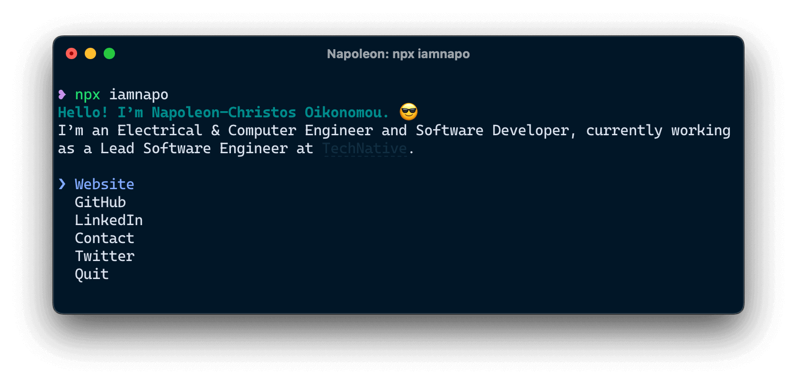

# iamnapo

> The [Napoleon Oikonomou](https://iamnapo.me) CLI

[](https://travis-ci.com/iamnapo/iamnapo) [](https://www.npmjs.com/package/iamnapo) [](./LICENSE)

<p align="center" flex-direction="row"></p>

## Usage

Install Node.js, then:

```console
$ npx iamnapo
```

Or, if you’re cool and use [GitHub Package Registry](https://github.com/features/package-registry):

```console
$ npx @iamnapo/iamnapo
```

## License

MIT © [Napoleon-Christos Oikonomou](https://iamnapo.me)
